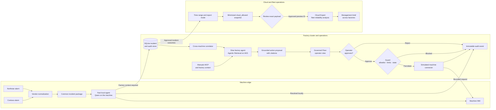

# Governed Floor

One governed flow for every machine, every vendor.

A mixed-vendor production line can turn one upstream failure into many apparently
independent alarms. Governed Floor demonstrates how local and factory AI can help
operators correlate those events without placing a model in the safety or real-time
control loop.

A Rust-based Factory Operations Assistant demonstrating one application-owned
inference contract across a machine-local fast path, a shared factory edge-cluster
slow path, and a policy-approved cloud expert path. The combined-mode Agentic
Retrieval configuration supports an evidence-bound, operator-approved
speed-reduction request through a simulated machine connector.

## Governed flow



The LLM never sends a machine command directly. The operator decides whether to
submit a proposal, and the Guard independently enforces the action allowlist,
parameter limits, incident state and operator identity. PLC and safety controls
remain authoritative outside this advisory demo.

## Application views

- `http://127.0.0.1:8000/` or `/machine` — a machine-local HMI showing the active
  alarm, normalized vendor context, local fast assessment, connectivity and timeline.
- `/operations` — the Governed Floor factory view with the incident queue,
  cross-vendor correlation, grounded sources, operator decisions and Guard outcomes.
- `/management` — a scoped post-incident reporting workflow: select a time range,
  inspect the exact minimized cloud payload, approve its server-held preview ID,
  then generate factual outcomes plus bounded Expert recommendations.
- `/demo` — presenter controls for deterministic scenarios and technical provider
  diagnostics.

The guided demo is presented as one accumulated factory shift: a routine local
alarm, a cross-vendor cascade, an unsafe 45% proposal that the Guard rejects, and a
network-loss incident that queues locally and synchronizes after recovery. Do not
reset between scenarios. The required final step creates an approved management
brief for a rolling 24-hour, seven-day or custom scope containing the accumulated
outcomes. Previewing performs no model call. Generation references the reviewed
server-side preview so the Expert receives exactly the displayed JSON.
Application-owned facts remain authoritative while the cloud Expert contributes
only bounded longer-term reliability recommendations.

For the network-loss scenario:

1. Select **Disconnect factory** in `/demo`.
2. Run **Network loss and recovery**.
3. Inspect the offline incident in the Machine HMI.
4. Return to `/demo` and select **Reconnect and sync**.
5. Open Governed Floor to review the recovered, grounded proposal.

Connectivity state and queued incidents are persisted in SQLite. Repeated reconnect
operations do not create duplicate proposals.

Run the end-to-end guided rehearsal against a started application with:

```powershell
cargo run --release --bin governed-floor-rehearse
```

The example configuration includes clearly labeled mock providers. The local
`config\demo.yaml` presentation configuration uses live Foundry Local models for the
Device and logical Edge targets: Qwen 2.5 0.5B for the fast path and Qwen 2.5 1.5B
for the slow path. Live device, edge, and cloud providers use
configuration-driven OpenAI-compatible HTTP semantics.

`config\demo.agentic.yaml` is the production-shaped configuration. It keeps the
device model local and uses the Agentic Retrieval Agents Runtime for the Edge target.
The slow result includes thread, run, tool, and citation evidence. Machine action is
eligible only after that grounded run completes with current evidence.

`config\demo.foundry.yaml` is the cloud fallback configuration. It uses:

- the local Qwen model for Fast;
- the deployment selected by `FOUNDRY_SLOW_MODEL` for Slow, grounded by
  application-side retrieval over `data\knowledge\source`;
- the deployment selected by `FOUNDRY_EXPERT_MODEL` for approved Expert analysis.

Start that configuration with a fresh Microsoft Entra token:

```powershell
$env:FOUNDRY_BASE_URL = "https://<foundry-resource>.openai.azure.com/openai/v1"
$env:FOUNDRY_SLOW_MODEL = "<slow-model-deployment>"
$env:FOUNDRY_EXPERT_MODEL = "<expert-model-deployment>"
.\run-foundry-fallback.ps1
```

The scripts acquire short-lived Microsoft Entra tokens at runtime. No credential or
environment-specific endpoint is stored in YAML or source control. Copy
`.env.example` to an ignored `.env.local` only as a reference; PowerShell
environment variables or explicit script parameters remain the runtime source.

## Run locally

Install the stable Rust toolchain, then:

```powershell
cargo run --bin factory-intelligence
```

Open `http://127.0.0.1:8000`.

The demo uses `config\demo.example.yaml` unless `DEMO_CONFIG` points to another file:

```powershell
Copy-Item config\demo.example.yaml config\demo.yaml
$env:DEMO_CONFIG = "config\demo.yaml"
cargo run --release --bin factory-intelligence
```

Set endpoint, model, and credential values through environment variables. Never put
credentials in YAML.

## Validate

```powershell
cargo fmt --check
cargo test
cargo run --bin factory-preflight
```

With the server running:

```powershell
cargo run --bin factory-smoke
cargo run --bin factory-concurrent-edge
cargo run --bin factory-rehearse
```

These tools report measured latency but make no benchmark claim.

## Configure live providers

Each provider supports:

- configurable base URL;
- configurable chat and health paths;
- no authentication, API-key authentication, or bearer-token authentication;
- a non-sensitive endpoint alias;
- explicit capability flags.

Enable a live provider in `config\demo.yaml`. When both live and mock providers are
enabled for the same target, the live provider is preferred.

The device and edge defaults use `/v1/chat/completions` and `/v1/models`. Verify and
override those paths against the target environment instead of assuming every
OpenAI-compatible service has identical URL construction.

## Configure the Agentic Retrieval slow path

Deploy Agentic Retrieval in `combined` mode, ingest the synthetic corpus under
`data\knowledge\source`, create an indexed-source MCP knowledge source, and link it
to the default knowledge base. Then run:

```powershell
.\run-agentic-demo.ps1 `
  -DomainName "<agentic-retrieval-domain>" `
  -ClientId "<agentic-retrieval-app-client-id>" `
  -AgentId "<knowledge-base-id>"
```

The local two-model configuration is a development stand-in. It does not provide
manual retrieval, MCP tools, citations, or action eligibility.

## Run the Foundry fallback

The fallback is useful when the Arc-enabled Agentic Retrieval environment is not
available. It preserves the Fast, Slow, and Expert demonstration, but it is not an
Arc edge deployment:

```powershell
$env:FOUNDRY_BASE_URL = "https://<foundry-resource>.openai.azure.com/openai/v1"
$env:FOUNDRY_SLOW_MODEL = "<slow-model-deployment>"
$env:FOUNDRY_EXPERT_MODEL = "<expert-model-deployment>"
.\run-foundry-fallback.ps1
```

The Slow adapter performs transparent lexical retrieval over the synthetic local
manuals, supplies the retrieved documents to the Foundry model, and returns local
retrieval evidence and file citations. The Expert path uses a separate stronger
Foundry deployment. The launch script acquires a Microsoft Entra token through the
current Azure CLI session.

## Evaluation

The `factory-eval` binary uses the verified Foundry Local on Azure Local control-plane
dataset and evaluation APIs. It requires:

```powershell
$env:EDGE_CONTROL_PLANE_URL = "https://your-control-plane"
$env:EDGE_CONTROL_PLANE_TOKEN = "<credential>"
cargo run --bin factory-eval -- --deployment "<deployment-name>"
```

Use `EDGE_CONTROL_PLANE_AUTH_MODE=bearer` for bearer authentication. The script
prints only results returned by the platform and never fabricates evaluation output.

## Safety and data

- All included incidents and evaluation rows are synthetic.
- Model output never becomes an arbitrary machine command.
- A reduce-speed request must reference successful inference evidence, remain within
  the application-defined 5-30% bound, and receive explicit operator approval.
- The current action connector is simulated and does not command physical machinery.
- Prompt and response content is excluded from structured logs by default.
- Full endpoint URLs and credentials are not returned by the application API.
- Cloud routing is rejected for `local_only` scenarios.
- Fallback is disabled by default.

See `docs\CLAIMS-AND-LIMITATIONS.md` before presenting the demo.
For machine deployment considerations, see `docs\ROBOT-DEPLOYMENT.md`.
