# Governed Floor

One governed flow for every machine, every vendor.

A mixed-vendor production line can turn one upstream failure into many apparently
independent alarms. Governed Floor demonstrates how local and factory AI can help
operators correlate those events without placing a model in the safety or real-time
control loop.

A Rust-based Factory Operations Assistant demonstrating a machine-local fast path,
an MQTT-separated factory edge-cluster slow path, deterministic operator governance,
and a separate Fabric and Foundry fleet-analytics path. The validated Agentic
Retrieval configuration supports an evidence-bound, operator-approved
speed-reduction request through a simulated machine connector.

## Governed flow

```mermaid
flowchart LR
    subgraph Machine["Machine edge"]
        VA["Northstar alarm"]
        VB["Contoso alarm"]
        Normalize["Vendor normalization"]
        Package["Common incident package"]
        Fast["Fast local agent<br/>Qwen on the machine"]
        Store[("SQLite incidents,<br/>audit, outbox and inbox")]
        HMI["Machine HMI"]
        Operations["Factory Operations view"]
        Decision{"Operator<br/>approves?"}
        Guard{"Local Guard<br/>allowlist · limits · state"}
        Connector["Simulated machine connector"]
        Audit["Governed audit event"]

        VA --> Normalize
        VB --> Normalize
        Normalize --> Package
        Package --> Fast
        Fast --> Store
        Store --> HMI
        Store --> Operations
        HMI --> Decision
        Operations --> Decision
        Decision -- Approve --> Guard
        Decision -- Reject --> Audit
        Guard -- Permitted --> Connector
        Guard -- Blocked --> Audit
        Connector --> Audit
        Audit --> Store
    end

    subgraph Factory["Factory Kubernetes cluster"]
        Broker["Mosquitto<br/>MQTT broker"]
        Worker["factory-advisory-worker"]
        Slow["Agentic Retrieval<br/>on Arc-connected AKS"]
        Sources["Manuals MCP<br/>and factory context"]
        Proposal["Grounded action proposal<br/>with citations"]

        Broker --> Worker
        Worker --> Slow
        Sources --> Slow
        Slow --> Proposal
        Proposal --> Worker
        Worker --> Broker
    end

    Store -- "MQTT QoS 1 request" --> Broker
    Broker -- "MQTT QoS 1 response" --> Store

    subgraph Fleet["Cloud and fleet operations"]
        FabricOutbox["Sanitized Fabric event outbox"]
        Eventstream["Fabric Eventstream"]
        Eventhouse["Eventhouse<br/>factory_incident_events"]
        Seed["Fabric notebook<br/>two synthetic factories"]
        DataAgent["Fabric Data Agent<br/>factory-fleet-analyst"]
        FleetAgent["Foundry prompt agent<br/>factory-fleet-manager"]
        Brief["Seven-day fleet brief"]

        FabricOutbox --> Eventstream
        Eventstream --> Eventhouse
        Seed --> Eventhouse
        Eventhouse --> DataAgent
        DataAgent --> FleetAgent
        FleetAgent --> Brief
    end

    Audit -- "Sanitized lifecycle projection" --> FabricOutbox
```



The LLM never sends a machine command directly. The operator decides whether to
submit a proposal, and the Guard independently enforces the action allowlist,
parameter limits, incident state and operator identity. PLC and safety controls
remain authoritative outside this advisory demo.

### Factory-local advisory messaging

`ADVISORY_TRANSPORT=direct` remains available for single-process development. The
validated presentation uses `ADVISORY_TRANSPORT=mqtt`, separating the machine and
factory advisory worker through a factory-local MQTT broker:

```text
Machine Rust application
  -> durable SQLite advisory outbox
  -> MQTT request topic
  -> factory-advisory-worker on Kubernetes
  -> Agentic Retrieval and manuals MCP
  -> MQTT response topic
  -> machine SQLite inbox and HMI
  -> local operator approval and Edge Guard
```

The machine application has no Agentic Retrieval responsibility in MQTT mode. It
publishes normalized evidence, receives a grounded proposal, and retains approval
and execution authority. Requests and responses use MQTT QoS 1 plus stable message
IDs and SQLite deduplication, so redelivery does not create another proposal or
execute an action twice.

Deploy the Mosquitto broker and advisory worker to the configured Kubernetes
cluster with:

```powershell
.\infra\deploy-advisory-messaging.ps1 -ForceBuild
```

The script builds the worker in ACR, creates ignored local MQTT credentials,
deploys a persistent broker and worker, discovers the broker address, and updates
`.env.local` for the machine application. The initial demo deployment uses a
password-authenticated broker endpoint on port 1883. A production deployment
should place the broker on a factory-private network and enable TLS or mTLS.

The worker currently receives an Agentic Retrieval bearer token through a
Kubernetes secret created by the deployment script. That token expires, so rerun
the deployment script to refresh it and restart the worker. Production should
replace this with workload identity or another renewable service identity.

## Application views

- `http://127.0.0.1:8000/` or `/machine` — a machine-local HMI showing the active
  alarm, normalized vendor context, local fast assessment, connectivity and timeline.
- `/operations` — the Governed Floor factory view with the incident queue,
  cross-vendor correlation, grounded sources, operator decisions and Guard outcomes.
- `/management` — an optional local scoped-reporting workflow retained for
  development; it is not part of the guided presentation.
- `/demo` — presenter controls for deterministic scenarios and technical provider
  diagnostics.

The guided demo is presented as one accumulated factory shift. The first scenario
shows the machine-local model reporting immediate observations while a grounded
factory advisory runs asynchronously. The resulting citations and bounded action
appear on both the Machine HMI and Governed Floor; an operator can decide from
either view, while the edge Guard remains the single execution authority. The
shift continues with a cross-vendor cascade, an unsafe 45% proposal that the Guard
rejects, and a network-loss incident that queues locally and synchronizes after
recovery. Do not reset between scenarios. The final presentation step moves to
Fabric to show the governed analytical events and Data Agent, then uses the
`factory-fleet-manager` prompt agent in Foundry to create a seven-day fleet brief.
The analytics path has no machine-control authority.

For the network-loss scenario:

1. Select **Disconnect factory** in `/demo`.
2. Run **Network loss and recovery**.
3. Inspect the offline incident in the Machine HMI.
4. Return to `/demo` and select **Reconnect and sync**.
5. Open Governed Floor to review the recovered, grounded proposal.

Connectivity state and queued incidents are persisted in SQLite. Repeated reconnect
operations do not create duplicate proposals.

## Fabric and Foundry fleet analytics

Operational incident handling does not depend on Fabric. An optional background
publisher projects the live application audit history into governed, append-only
fleet events through a Fabric Eventstream custom endpoint. The application stores
each projected event in the same SQLite transaction as the incident snapshot,
retries delivery independently, and deduplicates by `event_id`.

Only an allowlisted event projection is published. Raw alarm text, operator identity,
model reasoning, manual content, credentials, and infrastructure details are
excluded. Configure the optional publisher through `.env.local`:

```dotenv
FACTORY_ID=factory-demo-01
FABRIC_EXPORT_ENABLED=true
FABRIC_EVENTHUB_HOST=<eventstream-namespace>.servicebus.windows.net
FABRIC_EVENTHUB_NAME=<eventstream-entity-name>
```

The local demo uses the current Azure CLI identity for Entra authentication.
`GET /api/demo/fabric/status` reports pending, published, and failed outbox events.
When Fabric export is disabled or unavailable, machine assessment, advisory
messaging, operator approval and Guard execution continue normally.

### Refresh the seven-day fleet demo

The fleet brief can include two additional synthetic factories without running the
local application or rebuilding a container. Deploy the Fabric-native PySpark
notebook and execute it:

```powershell
.\infra\deploy-fabric-fleet-notebook.ps1 -Run
```

The notebook writes 27 lifecycle rows for seven incidents directly to the existing
`factory_incident_events` Eventhouse table. Timestamps are recalculated from the
current UTC time on every run. Stable event and incident IDs, together with the
Data Agent's `event_id` deduplication, refresh the represented seven-day period
without multiplying analytical counts.

The seed includes:

- a correlated coolant-pump and downstream robot incident at Riverton;
- historical bearing incidents at Riverton and Lakeside;
- a current recurring bearing incident with a correlated downstream symptom;
- executed governed actions, one policy rejection, resolved incidents, and active
  monitoring.

The notebook uses Fabric Spark capacity only while it runs. It bypasses the
Eventstream for this demo-only historical seed; live application events continue to
use the governed Eventstream path.

### Build the Foundry fleet-management agent

The optional `factory-fleet-manager` prompt agent uses GPT-5.4 for orchestration
and the published `factory-fleet-analyst` Fabric Data Agent through a delegated
Fabric IQ connection. The Fabric tool receives the signed-in user's identity and
honors that user's Fabric permissions.

Set these values in the ignored `.env.local` file or in the process environment:

```dotenv
FOUNDRY_PROJECT_ENDPOINT=https://<foundry-resource>.services.ai.azure.com/api/projects/<project>
FOUNDRY_AGENT_MODEL=factory-expert-gpt54
FOUNDRY_FABRIC_CONNECTION_NAME=factory-fabric-iq
FOUNDRY_FLEET_AGENT_NAME=factory-fleet-manager
FABRIC_WORKSPACE_ID=<fabric-workspace-id>
FABRIC_DATA_AGENT_ID=<published-data-agent-id>
FABRIC_KQL_DATABASE_ID=<kql-database-id>
```

Then create or update the Fabric IQ connection, harden the Data Agent to structured
columns, publish it, create a new Foundry agent version, and run a live smoke test:

```powershell
.\infra\configure-foundry-fleet-agent.ps1 -SmokeTest
```

The Foundry/Fabric agent is a fleet-analytics path and has no machine-control
authority. The optional local `/management` workflow remains independent of it.

Run the end-to-end guided rehearsal against a started application with:

```powershell
cargo run --release --bin governed-floor-rehearse
```

The example configuration includes clearly labeled mock providers. The local
`config\demo.yaml` presentation configuration uses live Foundry Local models for the
Device and logical Edge targets: Qwen 2.5 0.5B for the fast path and Qwen 2.5 1.5B
for the slow path. Live device, edge, and cloud providers use
configuration-driven OpenAI-compatible HTTP semantics.

`config\demo.agentic.yaml` is the production-shaped configuration. It keeps the
device model local and uses the Agentic Retrieval Agents Runtime for the Edge target.
The slow result includes thread, run, tool, and citation evidence. Machine action is
eligible only after that grounded run completes with current evidence.

`config\demo.foundry.yaml` is the cloud fallback configuration. It uses:

- the local Qwen model for Fast;
- the deployment selected by `FOUNDRY_SLOW_MODEL` for Slow, grounded by
  application-side retrieval over `data\knowledge\source`;
- the deployment selected by `FOUNDRY_EXPERT_MODEL` for approved Expert analysis.

Start that configuration with a fresh Microsoft Entra token:

```powershell
$env:FOUNDRY_BASE_URL = "https://<foundry-resource>.openai.azure.com/openai/v1"
$env:FOUNDRY_SLOW_MODEL = "<slow-model-deployment>"
$env:FOUNDRY_EXPERT_MODEL = "<expert-model-deployment>"
.\run-foundry-fallback.ps1
```

The scripts acquire short-lived Microsoft Entra tokens at runtime. No credential or
environment-specific endpoint is stored in YAML or source control. Copy
`.env.example` to an ignored `.env.local` only as a reference; PowerShell
environment variables or explicit script parameters remain the runtime source.

## Run locally

Install the stable Rust toolchain, then:

```powershell
cargo run --bin factory-intelligence
```

Open `http://127.0.0.1:8000`.

The demo uses `config\demo.example.yaml` unless `DEMO_CONFIG` points to another file:

```powershell
Copy-Item config\demo.example.yaml config\demo.yaml
$env:DEMO_CONFIG = "config\demo.yaml"
cargo run --release --bin factory-intelligence
```

Set endpoint, model, and credential values through environment variables. Never put
credentials in YAML.

## Validate

```powershell
cargo fmt --check
cargo test
cargo run --bin factory-preflight
```

With the server running:

```powershell
cargo run --bin factory-smoke
cargo run --bin factory-concurrent-edge
cargo run --bin factory-rehearse
```

These tools report measured latency but make no benchmark claim.

## Configure live providers

Each provider supports:

- configurable base URL;
- configurable chat and health paths;
- no authentication, API-key authentication, or bearer-token authentication;
- a non-sensitive endpoint alias;
- explicit capability flags.

Enable a live provider in `config\demo.yaml`. When both live and mock providers are
enabled for the same target, the live provider is preferred.

The device and edge defaults use `/v1/chat/completions` and `/v1/models`. Verify and
override those paths against the target environment instead of assuming every
OpenAI-compatible service has identical URL construction.

## Configure the Agentic Retrieval slow path

The validated AKS evaluation deploys Agentic Retrieval in CPU-only `agentic` mode.
An internal bridge uses AKS Workload Identity to invoke the keyless Foundry GPT-5
mini deployment, and the default knowledge base uses the authenticated remote
manuals MCP source. The deployment sequence is documented in `infra\README.md`.

For the AKS demo, copy `.env.example` to the ignored `.env.local` file and set:

```dotenv
FACTORY_AGENTIC_DOMAIN=<agentic-retrieval-domain>
FACTORY_AGENTIC_CLIENT_ID=<agentic-retrieval-app-client-id>
FACTORY_RESOURCE_GROUP=<aks-resource-group>
FACTORY_CLUSTER_NAME=<aks-cluster-name>
FOUNDRY_BASE_URL=https://<foundry-resource>.openai.azure.com/openai/v1
FOUNDRY_EXPERT_MODEL=<expert-model-deployment>
```

Then start the complete demo directly:

```powershell
.\infra\deploy-advisory-messaging.ps1
.\run-aks-agentic-demo.ps1
```

Explicit parameters and existing process environment variables take precedence
over `.env.local`. When the configured AKS cluster is stopped, the launcher starts
it and waits for Agentic Retrieval to become available. The advisory deployment
command refreshes the worker's time-limited Agentic token and restarts the worker.
The lower-level Agentic-only launcher can still be run with:

```powershell
.\run-agentic-demo.ps1 `
  -DomainName "<agentic-retrieval-domain>" `
  -ClientId "<agentic-retrieval-app-client-id>" `
  -AgentId "<knowledge-base-id>"
```

The local two-model configuration is a development stand-in. It does not provide
manual retrieval, MCP tools, citations, or action eligibility.

## Run the Foundry fallback

The fallback is useful when the Arc-enabled Agentic Retrieval environment is not
available. It preserves the Fast, Slow, and Expert demonstration, but it is not an
Arc edge deployment:

```powershell
$env:FOUNDRY_BASE_URL = "https://<foundry-resource>.openai.azure.com/openai/v1"
$env:FOUNDRY_SLOW_MODEL = "<slow-model-deployment>"
$env:FOUNDRY_EXPERT_MODEL = "<expert-model-deployment>"
.\run-foundry-fallback.ps1
```

The Slow adapter performs transparent lexical retrieval over the synthetic local
manuals, supplies the retrieved documents to the Foundry model, and returns local
retrieval evidence and file citations. The Expert path uses a separate stronger
Foundry deployment. The launch script acquires a Microsoft Entra token through the
current Azure CLI session.

## Evaluation

The `factory-eval` binary uses the verified Foundry Local on Azure Local control-plane
dataset and evaluation APIs. It requires:

```powershell
$env:EDGE_CONTROL_PLANE_URL = "https://your-control-plane"
$env:EDGE_CONTROL_PLANE_TOKEN = "<credential>"
cargo run --bin factory-eval -- --deployment "<deployment-name>"
```

Use `EDGE_CONTROL_PLANE_AUTH_MODE=bearer` for bearer authentication. The script
prints only results returned by the platform and never fabricates evaluation output.

## Safety and data

- All included incidents and evaluation rows are synthetic.
- Model output never becomes an arbitrary machine command.
- A reduce-speed request must reference successful inference evidence, remain within
  the application-defined 5-30% bound, and receive explicit operator approval.
- The current action connector is simulated and does not command physical machinery.
- Prompt and response content is excluded from structured logs by default.
- Full endpoint URLs and credentials are not returned by the application API.
- Cloud routing is rejected for `local_only` scenarios.
- Fallback is disabled by default.

See `docs\CLAIMS-AND-LIMITATIONS.md` before presenting the demo.
For machine deployment considerations, see `docs\ROBOT-DEPLOYMENT.md`.
